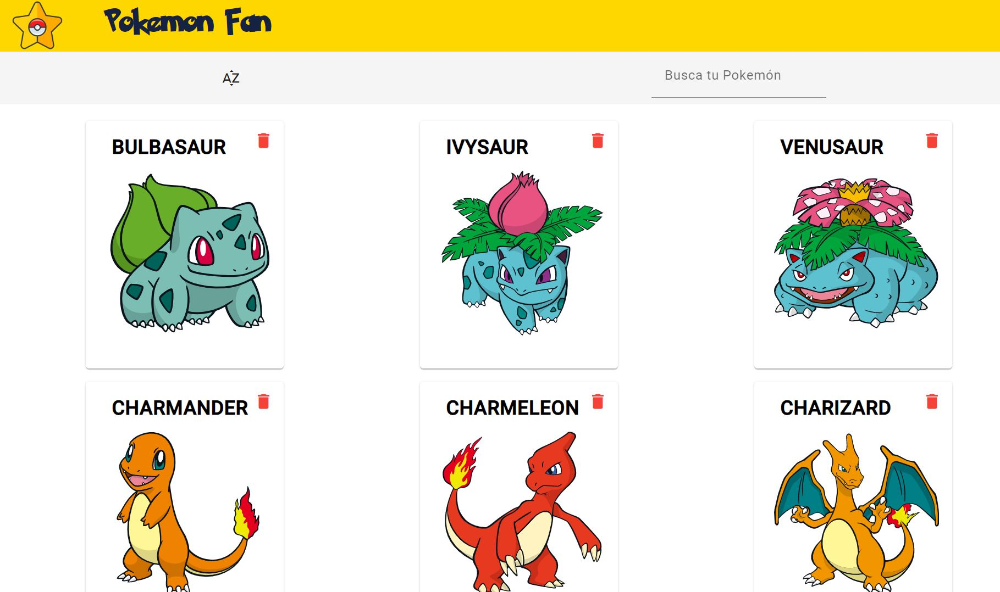

Pokemon Fan
===

##  Información General

Este proyecto consiste en una fan page con temática de Pokemón, en la cual se puede realizar una busqueda por nombre y ordenar alfabéticamente de manera ascendente o descendente. 

Para ver la página consulte el siguiente [enlace]()

***

## Tecnologías
Las tecnologías utilizadas en el proyecto:
* [Angular](https://angular.io/): Version 15.2.6 
* [Angular Material](https://material.angular.io/): Version 16.0.1
* [nodejs](https://nodejs.org/en): Version 18.16.0
***

## Instalación
```
$ git clone https://github.com/misdelymorales/pokemon-list
$ cd ../path/to/the/file
$ npm install
$ ng serve
```
***

<h3 align="center"> Fan Page Pokemón -  Misdely Morales  </h3>